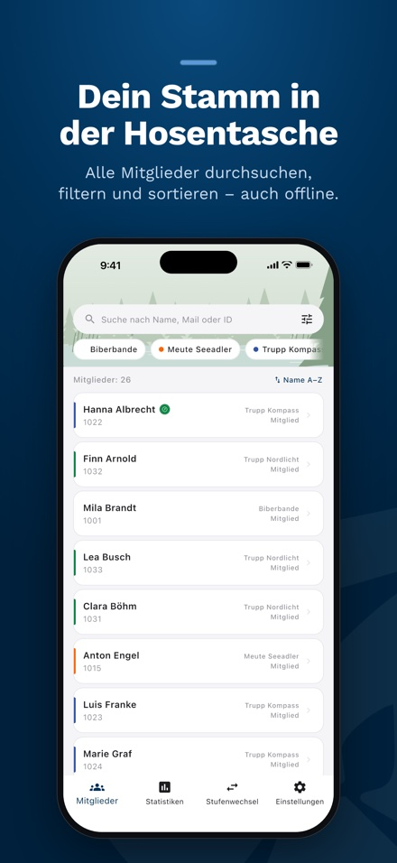
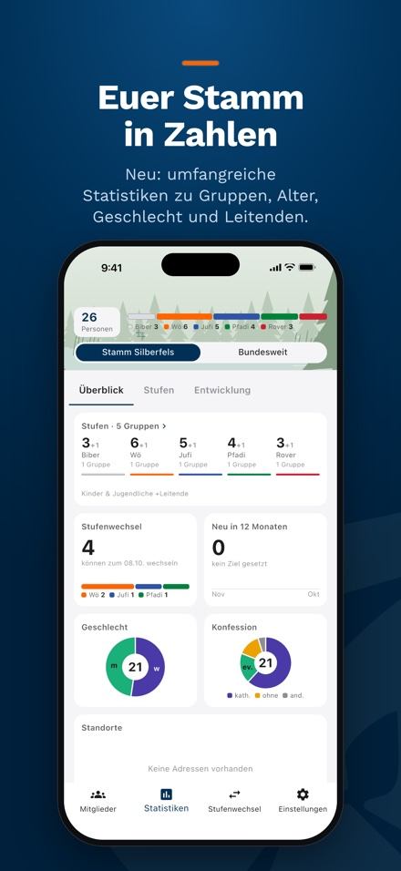
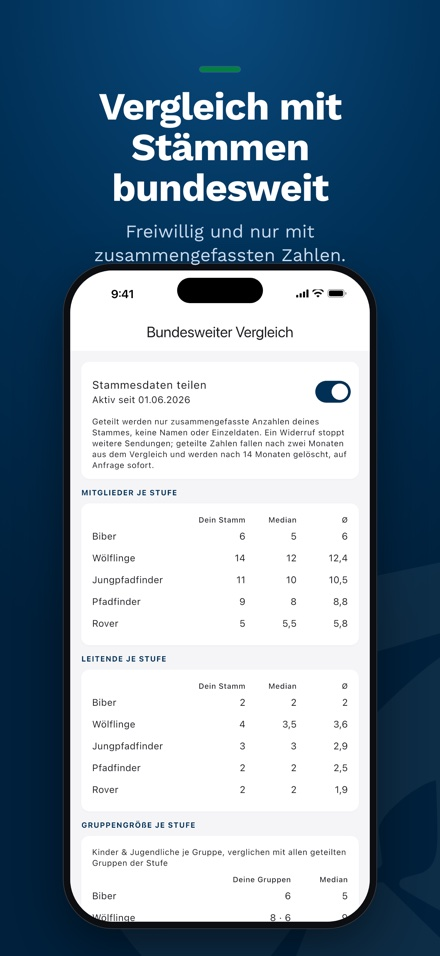
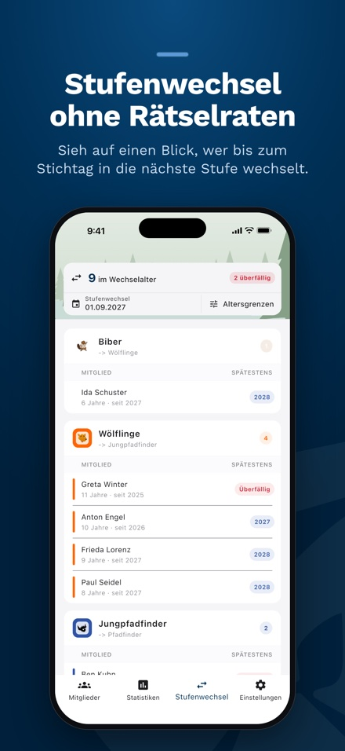

<!-- markdownlint-disable MD033 MD041 -->

# NaMi

**Dein Stamm in der Hosentasche.** Die App für Leitende in der DPSG: Mitglieder, Statistik und Stufenwechsel direkt aus der NaMi (Hitobito), auch offline.

Version 1.0 erscheint Anfang 2027, in den Stores liegt bis dahin noch die Vorgängerversion. Vorabversion für iOS über [TestFlight](https://testflight.apple.com/join/YGeELMUq).

<table>
  <tr>
    <td></td>
    <td></td>
    <td></td>
    <td></td>
  </tr>
</table>

## Funktionsumfang

- **Mitglieder:** suchen, filtern, sortieren, anrufen und mailen; Details mit Rollenverlauf, Geschwistern und Qualifikationen.
- **Offline:** nach dem ersten Laden verschlüsselt auf dem Gerät, Änderungen werden vorgemerkt und später gesendet.
- **Bearbeiten ohne Konflikte:** parallele Änderungen führt die App automatisch zusammen, echte Konflikte löst du Feld für Feld.
- **Statistik:** anpassbare Kacheln zu Gruppen, Alter, neuen Mitgliedern und Bindung, mit Zielwerten und Verlauf.
- **Bundesvergleich:** freiwillig und nur mit zusammengefassten Zahlen, Median und Durchschnitt teilnehmender Stämme.
- **Stufenwechsel:** Vorschlag zum Stichtag mit eigenen Altersgrenzen.
- **Qualifikationen:** Führungszeugnis, Prävention und Erste Hilfe im Blick, mit Erinnerungen.
- **Arbeitskontext:** zwischen Stamm, Bezirk und weiteren Ebenen wechseln, passend zu den Rechten in Hitobito.
- **Außerdem:** Geburtstagserinnerungen, Karte aller Stämme, App-Sperre, Erfolge, Hell und Dunkel, Demo ohne Login.

Mehr dazu in der [Funktionsübersicht](https://digital-scouts.github.io/dpsg-nami-app/), im [Handbuch](https://digital-scouts.github.io/dpsg-nami-app/handbuch/) und unter [Technik](https://digital-scouts.github.io/dpsg-nami-app/technik/).

## Datenschutz

Mitgliederdaten kommen direkt aus Hitobito und bleiben verschlüsselt auf dem Gerät. Es gibt keinen Server der App für Mitgliedsdaten. Nutzungsanalyse und Bundesvergleich gibt es nur mit Einwilligung. Details: [Datenschutz im Handbuch](https://digital-scouts.github.io/dpsg-nami-app/handbuch/datenschutz/) und [Datenschutzerklärung](https://digital-scouts.github.io/dpsg-nami-app/app-privacy-policy).

## Hinweis

Die App wird privat entwickelt. Sie ist kein Angebot der DPSG und wird von ihr weder betrieben noch autorisiert.

## Mitmachen

Das Repository enthält die Flutter-App und den Statistikserver unter [server/](server/). Setup, Versionierung, CI und Release-Ablauf stehen in [CONTRIBUTING.md](CONTRIBUTING.md). Fehler und Wünsche gerne als [Issue](https://github.com/digital-scouts/dpsg-nami-app/issues).
