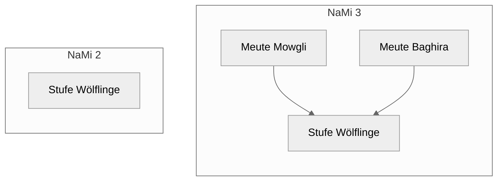

Seit dem letzten Beitrag ist viel passiert. Die DPSG arbeitet an ihrer neuen Mitgliederverwaltung auf Basis von Hitobito, der NaMi 3, und plant die Veröffentlichung für das erste Quartal 2027. Die App wird zeitgleich mit dem neuen System an den Start gehen: mit vielen neuen Funktionen und einer deutlich stabileren Basis.

## Vertraut bleibt vertraut

Der Umbau unter der Haube war groß, an der Oberfläche bleibt vieles, wie ihr es kennt. Mitglieder, Statistik, Stufenwechsel und Einstellungen findet ihr weiterhin dort, wo ihr sie kennt. Wer die App heute nutzt, findet sich auch in der neuen Version schnell zurecht. Das soll euch den Umstieg auf die NaMi 3 erleichtern, der für viele ohnehin schon genug Neues mitbringt.

## Was neu dazukommt

- **Bearbeiten ohne Netz:** Änderungen merkt die App vor und sendet sie später. Haben andere parallel im Web etwas geändert, führt die App beides zusammen; echte Konflikte löst ihr Feld für Feld.
- **Statistik** aus Kacheln, die ihr selbst zusammenstellt, mit Zielwerten, Verlauf und einer eigenen Ansicht je Gruppe.
- **Bundesvergleich:** freiwillig und nur mit zusammengefassten Zahlen. Seht, wie euer Stamm im Vergleich zu anderen teilnehmenden Stämmen dasteht.
- **Qualifikationen:** Führungszeugnis, Präventionsschulung und Erste Hilfe im Blick, mit Erinnerung vor dem Ablauf.
- **Arbeitskontext:** Wer im Stamm und im Bezirk aktiv ist, wechselt zwischen den Ebenen.
- **Außerdem:** Geburtstagserinnerungen, App-Sperre mit Face ID oder Fingerabdruck, Erfolge, helle und dunkle Darstellung und eine Demo ohne Login.



Alles im Detail steht im [Handbuch]({{ '/handbuch/' | relative_url }}).

## Gruppen statt Stufen

Die größte fachliche Änderung bringt die NaMi 3 selbst mit. Was bisher eine Stufe war, ist jetzt eine oder mehrere Gruppen, die einer Stufe zugeordnet sind: eure Meuten, Trupps und Runden. Habt ihr zwei Wölflingsmeuten, legt ihr in Hitobito zwei Gruppen an.

Für viele dürfte das einiges einfacher machen. Wer bisher mit Tags gearbeitet hat, um zwei Trupps auseinanderzuhalten, braucht diesen Umweg nicht mehr. Die App filtert die Mitgliederliste deshalb nicht mehr nach Stufen, sondern nach den Gruppen, die ihr in Hitobito angelegt habt. Wem das nicht reicht, der baut sich eigene Gruppen aus Regeln, etwa „alle Leitenden im Trupp Kompass“. Auch die Statistik zeigt jede Gruppe einzeln.



{: .wichtig }
Vieles könnt ihr in der App selbst einstellen, etwa Stichtag und Altersgrenzen für den Stufenwechsel oder eigene Gruppen. Am Ende lebt die App aber davon, wie gut ihr eure Daten in der NaMi strukturiert und pflegt: eine Gruppe je Meute, Trupp und Runde, aktuelle Rollen und vollständige Geburtsdaten.

## Ein feineres Rechtemodell und offene Fragen

Hitobito vergibt Rechte genauer als die alte NaMi. Leitende sehen künftig in der Regel nur noch die Mitglieder ihrer eigenen Gruppe und nicht mehr den ganzen Stamm. Für den Datenschutz ist das ein Gewinn, für die App eine Herausforderung: Stufenwechsel und Statistiken leben vom Blick über die eigene Gruppe hinaus. Eine Truppleitung sieht zum Beispiel, wer aus dem eigenen Trupp herauswächst, aber nicht, wer aus der Meute nachkommt.

Die App zeigt heute schon, was mit den jeweiligen Rechten möglich ist: Wer nur eine Gruppe lesen darf, bekommt die Statistik dieser Gruppe und vergleicht sie bundesweit mit Gruppen derselben Stufe. Wie ihr trotzdem zu vergleichbaren Infos für Stufenwechsel und Stammesstatistik kommt, ist aber noch nicht abschließend gelöst. **Hier bin ich auf euer Feedback angewiesen:** Wie plant ihr Stufenwechsel heute, wer macht das bei euch, und welche Zahlen braucht ihr wirklich? Schreibt mir über [Probleme melden]({{ '/handbuch/probleme-melden/' | relative_url }}), per [GitHub-Issue](https://github.com/digital-scouts/dpsg-nami-app/issues) oder an [dev@jannecklange.de](mailto:dev@jannecklange.de).

## Zwei Lücken in der Schnittstelle

Die NaMi 2 (ICA) hatte einen Vorteil: Ihre Schnittstelle lieferte alles, was auch im Web zu sehen war. Hitobito hat eine eigene, schlankere Schnittstelle, die nicht alles bietet, was die Weboberfläche kann. Daraus ergeben sich derzeit zwei echte Lücken, die den Funktionsumfang der App einschränken:

1. **Neue Kontaktangaben und Mitglieder:** Hitobito verlangt für jede Telefonnummer, E-Mail-Adresse und Adresse eine Kategorie, etwa „Mobil“ oder „Privat“. Welche Kategorien es gibt, kann die App über die Schnittstelle nicht abfragen. Bestehende Angaben lassen sich bearbeiten, neue aber nicht anlegen. Damit lassen sich auch neue Mitglieder aus der App nicht zuverlässig anlegen.
2. **Vergangene Rollen:** Die Schnittstelle liefert nur aktuelle Rollen. Was beendet ist, kann die App nicht anzeigen. Der Rollenverlauf in den Mitgliedsdetails beginnt deshalb mit der ältesten noch aktiven Rolle.

Für beide Punkte liegt bei Hitobito bereits ein Vorschlag zur Erweiterung der Schnittstelle. Ich hoffe, dass beide angenommen werden und die Lücken bis zum Start geschlossen sind.

## Entwickelt mit KI

Ein offenes Wort zur Entwicklung: Die App entsteht mit KI. Anders wäre es für mich als Einzelnen neben Job und Ehrenamt nicht machbar, diesen Umfang in dieser Qualität zu liefern. Auch wenn man die App also „Vibe Code“ nennen könnte: Werft eure Vorurteile über den Zaun. Als Softwareentwickler arbeite ich hauptberuflich mit KI, kenne die typischen Probleme und weiß, wo Sicherheitslücken entstehen und wie man sie adressiert.

Konkret heißt das: Jede Funktion ist durch automatisierte Tests abgesichert, jedes Bauteil der Oberfläche lässt sich in Storybook einzeln prüfen, und neue Ansichten durchlaufen mehrere Entwurfsrunden, bevor sie in die App kommen. Vor ein paar Tagen habe ich die App außerdem fünf Stunden lang von KI auf Fehler, Sicherheitslücken und Barrierefreiheit durchleuchten lassen, mit über 20 Millionen Token. Dabei kamen über 200 Befunde heraus: viele kleine Verbesserungen und ein paar echte Sicherheitslücken. Die Sicherheitslücken sind bereits behoben, an den übrigen Befunden arbeite ich in den nächsten Tagen weiter. Den aktuellen Stand findet ihr in den [Issues auf GitHub](https://github.com/digital-scouts/dpsg-nami-app/issues). Das macht mich noch lange nicht perfekt. Wie in jedem System kann es trotzdem Lücken geben, und auch dafür bin ich für Hinweise dankbar.

In den Jahren der Entwicklung habe ich immer wieder gemerkt, wie stark die Modelle werden und wie unterschiedlich man mit ihnen arbeiten kann. Die Entwürfe aus den Feedbackrunden werden spürbar besser. Inzwischen muss ich mich eher bremsen, mich bei neuen Ideen und Erweiterungen nicht zu überschlagen, damit genug Zeit bleibt, die Qualität zu prüfen und zu bestätigen.

## Wie es weitergeht

Bis zum Start der NaMi 3 arbeite ich an den offenen Punkten. Eine echte Vorabversion mit euren eigenen Daten ist leider noch nicht möglich, solange die NaMi 3 nicht live ist. Einen ersten Eindruck bekommt ihr trotzdem: Über [TestFlight](https://testflight.apple.com/join/YGeELMUq) für iOS und den [offenen Test im Play Store](https://play.google.com/store/apps/details?id=de.jlange.nami.app) für Android könnt ihr die neue App installieren und im Demo-Modus ohne Login ausprobieren, mit einem erfundenen Stamm und den Rechten von Vorstand, Leitung oder Bezirk.

Spätestens zum Start bin ich auf eure Rückmeldungen angewiesen. Je mehr Feedback ich bekomme, desto besser passt die App zu eurem Alltag im Stamm.
