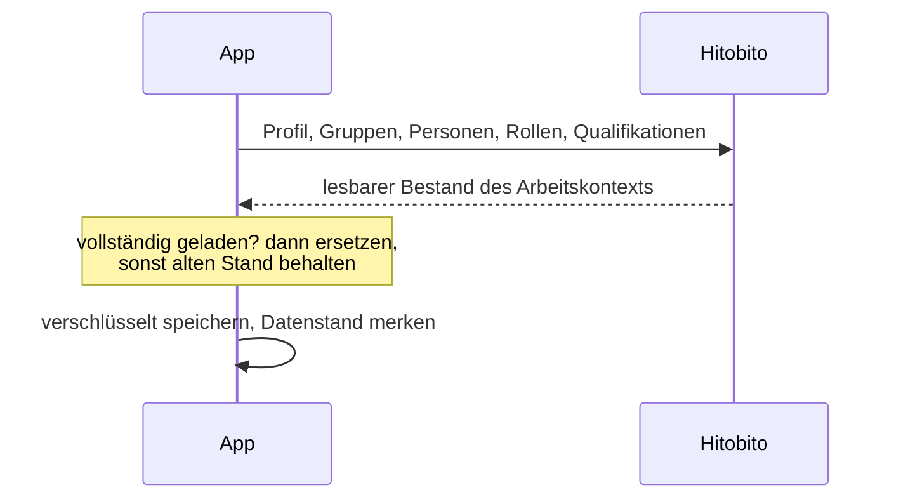
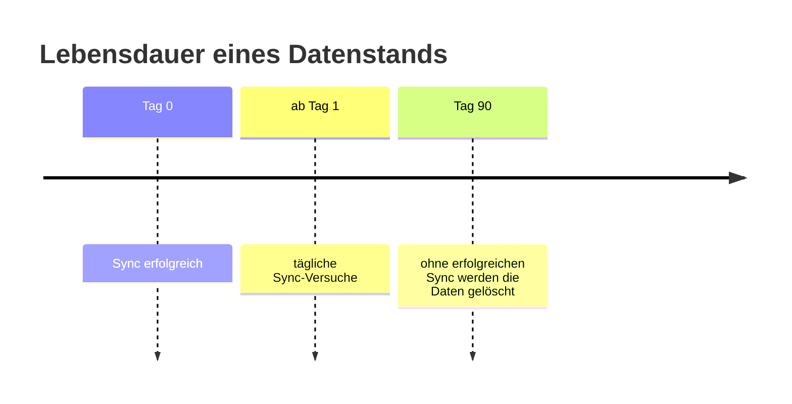

# Anmeldung, Sitzung und Offline-Daten
{: .no_toc }

Wie die App sich bei Hitobito anmeldet, wann sie synchronisiert und wie lange Daten auf dem Gerät bleiben.
{: .lead }

1. TOC
{:toc}

## Anmeldung

Die App nutzt OAuth 2.0 mit Authorization Code und PKCE (`S256`) gegen Hitobito. Die Anmeldung läuft im Browser des Systems, die App sieht das Passwort nie.

| Baustein | Umsetzung |
|:--|:--|
| Scopes | `openid name email api with_roles` |
| Tokens | Access- und Refresh-Token im Schlüsselbund (iOS) bzw. Keystore (Android) |
| Mitgliederdaten | Hive-Box, AES-verschlüsselt; der Schlüssel liegt im Schlüsselbund bzw. Keystore |
| Profil | Name, E-Mail, Sprache und Rollen aus dem OAuth-Profil; die Sprache setzt die App-Sprache |

Nach einer Neuinstallation ist eine neue Anmeldung nötig, auch wenn der iOS-Schlüsselbund noch eine frühere Sitzung enthält.

## Sync

- Die App versucht etwa alle 24 Stunden zu aktualisieren (`HITOBITO_REFRESH_INTERVAL_HOURS`).
- Während aktiver Nutzung prüft sie, ob ein blockierter Sync wieder möglich ist, etwa wenn WLAN verfügbar wird.
- Mobile Daten einschränken erlaubt Sync nur im WLAN. Verbindungen, die weder WLAN noch Mobilfunk sind (etwa nur VPN), gelten als mobile Daten.
- Ein nur teilweise geladener Sync gilt als fehlgeschlagen. Die App behält dann den vorherigen Stand, Datenstand und Löschfrist bleiben unverändert.

## Sitzung und Token

Hitobito gibt Access-Tokens mit zwei Stunden Laufzeit aus und löscht Refresh-Tokens, die etwa eine Woche nicht erneuert wurden.

- Vor jedem Zugriff erneuert die App ein ablaufendes Token. Gleichzeitige Zugriffe teilen sich eine Erneuerung, weil Hitobito den Refresh-Token bei jeder Nutzung austauscht.
- Beim Start, beim Entsperren und beim Zurückkehren erneuert die App ein Token, das älter als zwölf Stunden ist. Das geschieht auch bei Mobile Daten einschränken, weil nur wenige Bytes übertragen werden.
- Bei erlaubten Mitteilungen erinnert die App sechs Tage nach der letzten Erneuerung daran, sie kurz zu öffnen.
- Jede Anfrage an Hitobito bricht nach 30 Sekunden ohne Antwort ab, Token- und Profilanfragen nach 20 Sekunden.

## Abgelaufene Sitzung

Die App unterscheidet, warum eine Erneuerung scheitert.

| Antwort des Token-Endpunkts | Folge |
|:--|:--|
| `400 invalid_grant` oder `401` | Anmeldung beendet, Hinweis „Anmeldung abgelaufen“ |
| `429`, `5xx`, Zeitlimit, keine Verbindung | vorübergehende Störung, Anmeldung bleibt bestehen |
| `invalid_client` | Konfigurationsfehler, eine neue Anmeldung hilft nicht |

Den Hitobito-Login öffnet die App nur nach ausdrücklicher Zustimmung.

| Auslöser | Verhalten bei abgelaufener Anmeldung |
|:--|:--|
| Start-, Intervall- und Verbindungs-Sync, Entsperren, Profilseite | kein Login-Fenster, Hinweis in den Mitteilungen |
| Pull-to-Refresh, EFZ-Antrag | Rückfrage „Neu anmelden“, Login erst nach Tippen |
| Speichern einer Änderung | Änderung bleibt vorgemerkt, Meldung mit „Neu anmelden“ |
| Erster Start ohne geladene Daten | Ansicht „Erneute Anmeldung erforderlich“ mit „Neu anmelden“ und „Abmelden“ |

Nach der Neuanmeldung bleibt der Arbeitskontext sichtbar. Die App synchronisiert danach, falls fällig, und sendet vorgemerkte Änderungen.

Beendet das System die App, während der Login im Browser offen ist, erklärt der Anmeldebildschirm beim nächsten Start, dass die Anmeldung unterbrochen wurde.

## Wie lange Daten bleiben

| Ereignis | Folge für lokale Hitobito-Daten |
|:--|:--|
| Sync erfolgreich | ersetzt, Löschfrist beginnt neu |
| Sync fehlgeschlagen oder teilweise | alter Stand bleibt nutzbar |
| 90 Tage ohne erfolgreichen Sync (`HITOBITO_DATA_MAX_AGE_DAYS`) | gelöscht |
| Manuelles Abmelden | gelöscht; vorher Versuch, offene Änderungen zu senden, sonst Rückfrage |
| Kein lesbarer Layer mehr | abgemeldet und gelöscht, Grund auf dem Anmeldebildschirm |
| Wechsel des Arbeitskontexts | durch den neuen Kontext ersetzt |

## App-Sperre

Ist die App-Sperre aktiv und noch nicht entsperrt, finden keine Hitobito-Zugriffe statt. Sync und Nachsenden laufen erst nach der Entsperrung. Nach 60 Sekunden im Hintergrund fragt die App erneut (`HITOBITO_APP_LOCK_TIMEOUT_SECONDS`).

Ein Logout beendet laufende Vorgänge. Was sie danach noch liefern, verwirft die App.

## Demo-Modus

Die Demo spricht Hitobito nicht an und hält alle Daten nur im Speicher. Jeder Demo-Zugang sieht nur, was Hitobito seiner Rolle liefern würde. Den Bundesvergleich sendet sie an eine getrennte Testinstanz des Statistikservers.
