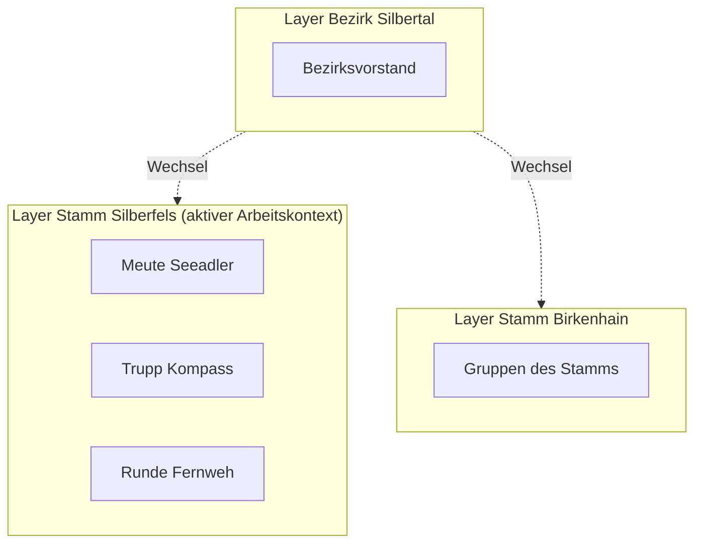

# Hitobito-Arbeitskontextmodell
{: .no_toc }

Wie die App aus den Rollen und Rechten in Hitobito ableitet, was sie zeigt. Die Bedienung steht im [Handbuch](../../handbuch/arbeitskontext/).
{: .lead }

1. TOC
{:toc}

## Grundregeln

- Die App arbeitet immer in genau einem aktiven Arbeitskontext. Ein Arbeitskontext ist genau ein Layer.
- Mitgliederliste, Suche, Statistik und alle weiteren Ansichten arbeiten nur innerhalb des aktiven Arbeitskontexts.
- Gruppen innerhalb eines Layers sind Filter oder Teilmengen, keine eigenen Kontexte.
- Unterlayer gehören nicht automatisch dazu. Sie werden nur über einen bewussten Wechsel geöffnet.
- Offline verfügbar ist genau ein Arbeitskontext. Ein Wechsel ersetzt den lokal gespeicherten Kontext.
- Die App zeigt genau den Bestand, den Hitobito lesbar zurückliefert. Einen eigenen Rechtebaum modelliert sie nicht.

## Welche Layer angeboten werden

Technisch sichtbare Layer sind nicht automatisch Arbeitskontexte. Angeboten werden nur Layer, die sich aus eigenen Rollen mit arbeitskontextrelevanten Lese- oder Schreibrechten ableiten lassen.

| Recht in Hitobito | Wirkung in der App |
|:--|:--|
| `layer_read`, `layer_full` | Layer der Rolle wird als Arbeitskontext angeboten |
| `layer_and_below_read`, `layer_and_below_full` | zusätzlich Unterlayer als eigene Wechselziele |
| `group_read`, `group_and_below_read` | macht den Layer relevant, sichtbar ist aber nur die Teilmenge der Gruppe |
| `contact_data` und ähnliche Zusatzrechte | erzeugen keinen Arbeitskontext und erweitern die Liste nicht |

Leere Layer ohne Personen bleiben zulässige Arbeitskontexte, weil sie für den Aufbau relevant sein können.

## Startkontext

Beim ersten Laden wählt die App den Primary Layer der Person, sofern er zu den relevanten Layern gehört. Sonst nimmt sie den ersten relevanten Layer einer stabil sortierten Liste.

## Gruppen, Stufen und Personen

- Die In-App-Stufe leitet die App global im Code aus dem Hitobito-Gruppentyp ab. Eine Gruppe entspricht höchstens einer Stufe.
- Personen werden Gruppen über ihre Rollen zugeordnet. Wer Rollen in mehreren Gruppen hat, erscheint in mehreren Filtern.
- Leere Gruppen zeigt die Leseansicht nicht an.
- Sonstige Gruppen sind keine vordefinierten Hauptfilter, lassen sich aber in eigenen Filtern nutzen. Die Standardgruppe „Rest“ enthält Personen ohne Stufe.

## Wenn Rechte wegfallen

Stellt ein Sync fest, dass kein relevantes Layer- oder Gruppenrecht mehr besteht, meldet die App ab, löscht die lokalen Daten und nennt den Grund auf dem Anmeldebildschirm. Bleibt nach geänderten Rechten noch etwas lesbar, ersetzt der Sync die Daten durch den neuen Stand.

Die ausführliche Konzeptfassung liegt im Repository unter `specs/hitobito-arbeitskontext-konzept.md`.
