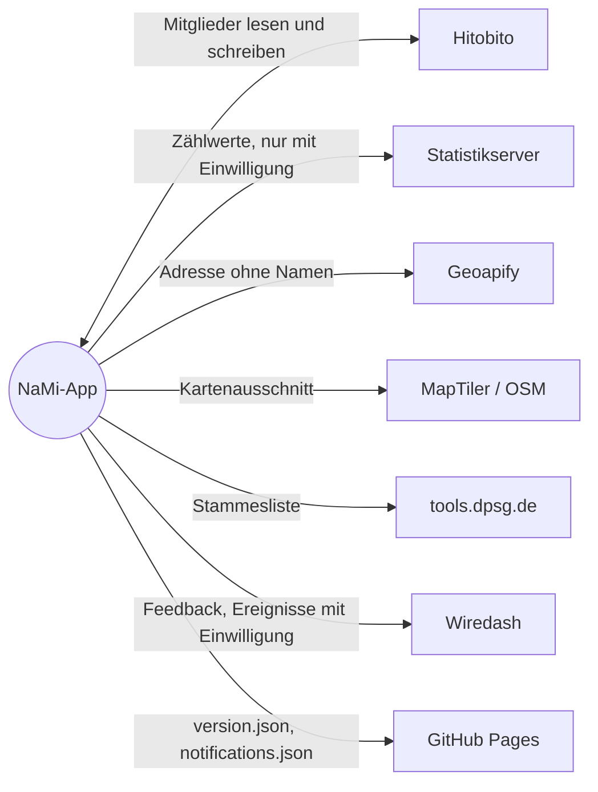

# Externe Dienste
{: .no_toc }

Alle Dienste, mit denen die App spricht. Die Kurzfassung für Nutzende steht unter [Handbuch → Datenschutz](../../handbuch/datenschutz/), verbindlich ist die [Datenschutzerklärung](../../app-privacy-policy).
{: .lead }

## Übersicht

| Dienst | Zweck | Gesendete Daten | Auslöser | Einwilligung |
|:--|:--|:--|:--|:--|
| Hitobito (NaMi der DPSG) | Anmeldung, Mitglieder laden und ändern | OAuth-Token, Änderungen | Sync, Speichern | – |
| Statistikserver der App | Bundesvergleich | Zählwerte je Gruppe, pseudonyme IDs | etwa wöchentlich (`STATS_SEND_INTERVAL_HOURS=168`) | je Stamm |
| [Geoapify](https://www.geoapify.com) | Geokodierung, Adressvorschläge | Adresstext ohne c/o-Zeile und Namen | Karte, Stammadresse, Standorte-Kachel | – |
| [MapTiler](https://www.maptiler.com) | Kartenkacheln | Kartenausschnitt, IP-Adresse | Kartenansicht | – |
| [OpenStreetMap](https://operations.osmfoundation.org/policies/tiles/) | Kartenkacheln, Rückfall ohne eigenen Tile-Endpunkt | Kartenausschnitt, IP-Adresse | Kartenansicht | – |
| DPSG-Stammessuche (`tools.dpsg.de`) | Stämme auf der Karte | IP-Adresse | Kartenansicht | – |
| [Wiredash](https://wiredash.com) | Feedback, Nutzungsereignisse, Versionsübersicht | siehe [Wiredash und Tracking](../wiredash/) | Feedback auf Wunsch, Ereignisse mit Einwilligung | Ereignisse ja |
| GitHub Pages | Update-Hinweis und Mitteilungen | IP-Adresse | höchstens alle 12 h bzw. stündlich | – |

## Details

### Hitobito

Alle Mitgliederdaten kommen direkt aus Hitobito und gehen direkt dorthin zurück. Es gibt keinen Server der App dazwischen. Anmeldung und Sync beschreibt [Anmeldung und Offline-Daten](../anmeldung-und-offline/).

### Statistikserver

Ein eigener Node-Server (`server/` im Repository), gehostet in Deutschland. Er nimmt nur Zählwerte an und speichert Stamm, Gruppen und Installation als Pseudonym. Bundesweite Werte gibt er nur an Installationen heraus, die in den letzten 14 Tagen geteilt haben, und nur bei genug teilnehmenden Stämmen. Wer keine Zahlen lesen kann, teilt nur die Gruppenstruktur des Stamms; das genügt zum Lesen, zählt aber nicht als teilnehmender Stamm. Geteilte Zahlen löscht er nach 14 Monaten.

### Geoapify

Free-Tarif mit 3000 Anfragen am Tag. Gesendet wird nur, wenn die Netzregel es erlaubt. Koordinaten speichert die App lokal, auch Fehlschläge für sieben Tage (`GEOAPIFY_NEGATIVE_CACHE_TTL_DAYS`). Nach HTTP `429` pausiert die App alle Geokodierungen, laut `Retry-After`, sonst eine Stunde.

### Karten

Der Tile-Anbieter ist über `MAP_TILE_URL` konfigurierbar, Standard ist MapTiler. Geladene Kacheln speichert die App zwischen. Die Diözesangrenzen liegen als GeoJSON in der App und brauchen keinen Dienst.

### GitHub Pages

Diese Seite liefert `version.json` für den Update-Hinweis und `notifications.json` für Mitteilungen in der App. Beide Dateien liegen im Repository unter `docs/`.
